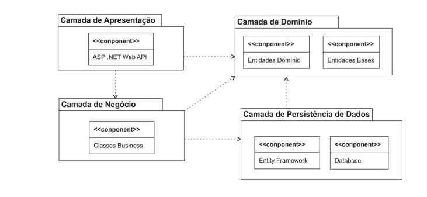

# Showroom
 
- Linguagem C# e Framework .NET6
- Projeto em camadas com Injeção de Dependência
- Uso de Generics
- Padrão Repository com Entity Framework Core para acesso a dados.
- Clean Code, endepoint de APIs acessivél com Swagger

##  Arquitetura Multicamadas

- Projeto possui uma arquitetura de software organizada em 
camadas, são elas: Camada de Apresentação, Camada de Negócio, Camada de 
Domínio e Camada de Persistência de Dados. As camadas interagem entre si, 
permitindo que todas as requisições feitas pelo usuário possam ser recebidas, 
processadas e respondidas da melhor forma possível. A imagem abaixo apresenta a 
arquitetura adotada no projeto:

    

## Continuação....

- Primeira fazer do projeto concluida.
- Para continuação do projeto sera implementado as seguintes estruturas:
  - Validations
  - Domain Notification
  - Criar uma Imagem da aplicação com Docker
  - Publicar no Azure